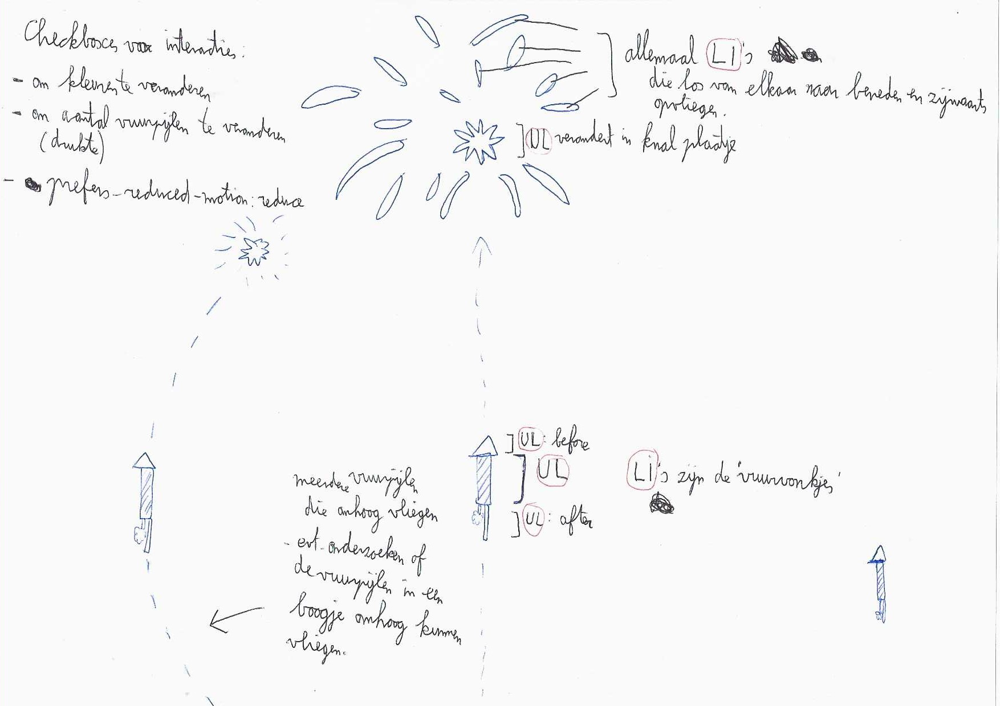

# CSS-to-the-rescue-eindopdracht. Procesverslag

## Week 1

Voor dit vak heb ik besloten om de magische vuurwerkshow te gaan maken waarbij ik zelfgemaakte vuurpijlen omhoog wil laten vuren die allemaal op een andere manier ontploffen.

Op het moment van schrijven weet ik nog niet met welke CSS-technieken ik als eerste aan de slag ga. Ik denk dat het het beste is als ik daar zelf tijdens het coderen achter ga komen.

Mijn grootste uitdaging is ongetwijfeld het maken van interacties en bewegende elementen zonder gebruik te maken van ID's, classes en JavaScript.

Bij de vuurwerkshow had ik een aantal ideeën bedacht:

- Één daarvan was dat de vuurpijlen niet recht omhoog maar in een vloeiende ronde baan zouden opstijgen.

- Een ander idee is dat je een interactie zou kunnen maken waarmee de gebruiker kon bepalen hoeveel vuurpijlen er tegelijk zouden verschijnen.

- Ook had ik bedacht dat je de kleuren van het vuurwerk kon aanpassen.

Deze ideeën werden afgelopen vrijdag dan ook goedgekeurd.

Hieronder heb ik een eerste schets gemaakt van mijn nog prille vuurwerkshow en de manier waarop ik mijn HTML wil maken:

Daarna ben ik aan de slag gegaan met het bouwen van een enkele vuurpijl die recht omhoog kan opstijgen. Zie de screenshot hieronder:

Zoals in mijn eerste schets al te zien is, was ik eerst van plan om met de CSS Pseudo Elements ::before en ::after het rode driehoekje en de stok en aansteeklont te maken. Het probleem echter was dat er maar twee pseudo elements waren voor de drie elementen die ik wilde maken. Daarom ben ik van plan om dit d.m.v. een ul met drie li's op te lossen.