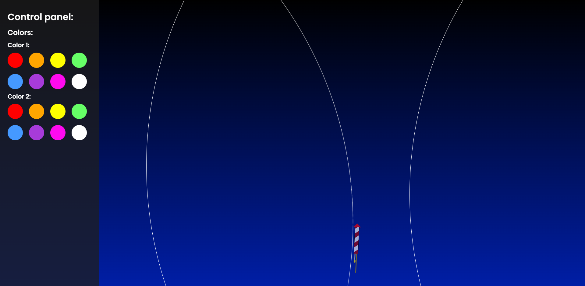

Link naar project: https://dustinschouten.github.io/CSS-to-the-rescue-eindopdracht./

# CSS-to-the-rescue-eindopdracht. Procesverslag

## Week 1

Voor dit vak heb ik besloten om de magische vuurwerkshow te gaan maken waarbij ik zelfgemaakte vuurpijlen omhoog wil laten vuren die allemaal op een andere manier ontploffen.

Op het moment van schrijven weet ik nog niet met welke CSS-technieken ik als eerste aan de slag ga. Ik denk dat het het beste is als ik daar zelf tijdens het coderen achter ga komen.

Mijn grootste uitdaging is ongetwijfeld het maken van interacties en bewegende elementen zonder gebruik te maken van ID's, classes en JavaScript.

Bij de vuurwerkshow had ik een aantal ideeën bedacht:

- Één daarvan was dat de vuurpijlen niet recht omhoog maar in een vloeiende ronde baan zouden opstijgen.

- Een ander idee is dat je een interactie zou kunnen maken waarmee de gebruiker kon bepalen hoeveel vuurpijlen er tegelijk zouden verschijnen.

- Ook had ik bedacht dat je de kleuren van het vuurwerk kon aanpassen.

Deze ideeën werden afgelopen vrijdag dan ook goedgekeurd.

Hieronder heb ik een eerste schets gemaakt van mijn nog prille vuurwerkshow en de manier waarop ik mijn HTML wil maken:

Daarna ben ik aan de slag gegaan met het bouwen van een enkele vuurpijl die recht omhoog kan opstijgen. Zie de screenshot hieronder:

Zoals in mijn eerste schets al te zien is, was ik eerst van plan om met de CSS Pseudo Elements ::before en ::after het rode driehoekje en de stok en aansteeklont te maken. Het probleem echter was dat er maar twee pseudo elements waren voor de drie elementen die ik wilde maken. Daarom ben ik van plan om dit d.m.v. een ul met drie li's op te lossen.

Ook heb ik al nagedacht over de manier waarop de vuurpijlen met een vloeiende curve zouden opstijgen, namelijk d.m.v. een onzichtbare cirkel als div die ik zou ronddraaien met transform:rotate.
Zie mijn breakdown schets hieronder:

Op de vuurvonkjes na (die komen later in dit procesverslag aan bod) heb ik mijn breakdown schets uitgewerkt en dit werkt goed. Om het idee van de vloeiende baan te laten zien heb ik de div een witte border gegeven.
Zie de screenshot hieronder:

## Week 2
In deze week heb ik me beziggehouden met het helemaal afmaken van mijn vuurpijl. Dat heb ik uitgewerkt volgens mijn breakdown-schets. Het rode driehoekje, het aansteeklontje en de vuurwerkstok.
Zie de screenshot hieronder:

Ook heb ik me beziggehouden met het maken van de vuurvonkjes. Zoals ik in mijn breakdown-schets eerder heb laten zien, heb ik de vuurvonkjes als list-items in een unordered list gegroepeerd.
Het coderen van vuurvonkjes is erg goed gegaan. Ik heb alle vuurvonkjes een aparte keyframe meegegeven waardoor ze allemaal een andere kant opvliegen. Ook heb ik ervoor gezorgd dat je doormiddel van custom properties de kleuren kan aanpassen.
Zie de screenshot hieronder:

Het meest lastige vond ik het maken van het control panel (zie de screenshots). Doordat de vuurwerkbanen als het ware over het control panel heen bewogen, kon ik niet op het panel klikken. Dit heb ik uiteindelijk opgelost door deze een z-index:1 mee te geven. Ook vond ik het lastig om te begrijpen hoe checkboxes, radiobuttons en labels werken en hoe je deze kon toepassen. Voor de rest is alles eigenlijk best soepel verlopen.

Tot nu toe heb ik nog geen nieuwe experimenten gedaan die 'mislukt' zijn. Wel heb ik een hoop nieuwe CSS-technieken geleerd met dit project:
- Ik heb geleerd dat je custom properties ook kan aanpassen door de CSS-regels heen, ipv het enkel definieren bij de :root.
- Ik heb geleerd hoe je de ~ en de + selector kunt toepassen. Ook heb ik de pseudo-class :is voor het eerst gebruikt.
- Wat ik ook niet wist, was dat je labels en radio buttons op een dusdanige manier kon gebruiken dat je hiermee een interactie kan creëeren waardoor je geen JavaScript hoeft te gebruiken.

Mijn nieuwe uitdagingen voor komende week:
- Bij alle keyframes die ik tot nu toe heb gebruikt, heb ik geen iteration-count gedefinieerd. Hierdoor zie je de vuurpijlen slechts één keer opstijgen en ontploffen, totdat je de pagina opnieuw refresht. Doordat de vuurpijl uit meerdere animaties bestaat, kun je niet zomaar bij iedere animatie afzonderlijk de iteration-count op infinite zetten. Dit probleem ga ik proberen op te lossen.
- Ook merk ik dat ik tegen een aantal responsive issues aanloop doordat ik gebruikmaak van de ronddraaiende banen. Ook dit probleem ga ik proberen op te lossen door te experimenteren met de property viewport min. Met de screenshot hieronder wordt dit probleem nogmaals duidelijk:

- Verder leek het me een leuk idee om voor alle vuurpijlen elk vuurvonkje apart te nemen en deze opnieuw in 'sub' vuurvonkjes te laten ontploffen. Dit zal ik proberen door elk vuurvonkje, nu nog een list-item, opnieuw als unordered-list met list-items te definieren.

## Voorjaarsvakantie + Week 3
- Laat je voortgang zien ('praatje met plaatjes').
In deze week (en in de voorjaarsvakantie) heb ik me beziggehouden met een aantal zaken:

### Het volledig responsive maken van de ronddraaiende banen van de vuurpijlen
Dit vond ik erg lastig om voor elkaar te krijgen, en al helemaal als je je scherm draait (waardoor de hoogte van het scherm groter wordt dan de breedte). Uiteindelijk heb ik dit opgelost door zowel de width en de height van deze cirkels (divs) op max(100vw,150vh) te zetten. Dit gebruik van view-port min en max was voor mij nieuw. Zie de screenshot hieronder:

Met in- en uitklapbaar control panel:

Zo ziet het eruit op een kleiner (gedraaid) scherm:

### Het toevoegen van sub-vuurvonkjes
De animatie die ik voorheen had gemaakt telde 12 vuurvonkjes voor iedere vuurpijl. Dit waren, zoals eerder vermeld, allemaal list-items in een unordered-list. Twee vuurvonkjes heb ik wat dikker gemaakt en met een hogere opacity wat langer laten 'branden'. Zie de screenshot hieronder: 

Hierna heb ik voor beide vuurvonkjes een nieuwe unordered-list met list-items gemaakt en elk nieuw vuurvonkje dezelfde animatie meegegeven.

### De vuurpijlanimatie oneindig door laten afspelen, om zo een 'show' te creëeren
Ook dit was vrij lastig omdat de vuurpijlen uit verschillende animaties bestaan, namelijk het opstijgen van de vuurpijl en het laten zien van de vuurvonkjes. Deze animaties moeten ook achter elkaar worden afgespeeld. Ik wist dat je animaties een delay van een bepaalde tijd kon meegeven, maar het probleem hierbij was dat delay's alleen na de allereerste iteratie werken en dat de animatie daarna zonder delays worden afgespeeld.
Om dit probleem op te lossen heb ik uiteindelijk de animaties als volgt opgesteld (ik heb niet letterlijk deze namen gebruikt):

- vuurpijl_opstijgen: 0% {beginpunt van de animatie} 33%,100% {eindpunt van de animatie}
- eerste_generatie_vuurvonkjes_animeren: 0%,32% {zet de opacity op 0} 33% {beginpunt van de animatie} 66%,100% {eindpunt van de animatie}
- tweede_generatie_vuurvonkjes_animeren: 0%,65% {zet de opacity op 0} 66% {beginpunt van de animatie} 100% {eindpunt van de animatie}

Op deze manier worden alle animaties in 1/3 van de tijd afgespeeld. De totale tijdsduur van alle animaties is de opsomming van alledrie de animaties apart.

### Het toevoegen van bomen.
Hiervoor heb ik gebruikgemaakt van CSS randomness door hierbij gebruik te maken van priemgetallen. Hiermee heb ik random patronen gecreëerd in de kleur, de hoogte en de positie van de boomstronken en in de kleur van de bladeren. Dit was voor mij een nieuwe manier om de kracht van CSS te gebruiken, zonder hierbij JavaScript te hoeven toepassen. Dit principe implementeren verliep voor mij redelijk soepel. De boombladeren heb ik overigens gemaakt met CSS-clip-paths. Ook dat was voor mij nieuw.

Al met al, kan ik vermelden dat er nog geen experimenten met CSS mislukt zijn.

Mijn nieuwe uitdagingen voor komende week:
- Aankomende week ga ik proberen om het reduce-motion principe toe te passen. Ik proberen om met dit principe te werken en een soort catalogus op te zetten met afbeeldingen van de animaties.
- 

Verder ga ik om de show af te maken wat meer interacties aan het control panel toevoegen.

